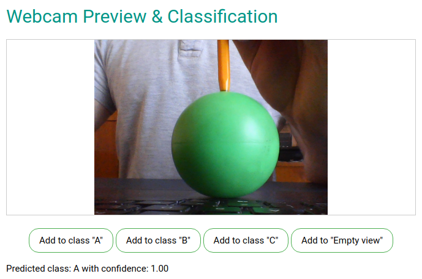

# Mobile Image Classifier

This project is a presentation of using [TensorFlow.js](https://www.tensorflow.org/js/) in browser for classifying images specified by a user.

## Preview

[Live version is here](http://thirsty-almeida-b3a4d4.netlify.com)

## Setup

To setup this project, go through the following steps:

- Download the repo
- Open the `index.html` in your browser
- Allow the browser to access your webcam
- Classify three items and one "Empty view"

## Testing

Select three items to classify. Assign to each item artificial class: "A", "B" and "C". While presenting given item to the webcam, click on the appropriate class button. When no item is visible, press the "Empty view" button to classify empty view.

After training and presenting trained image to the webcam, appropriate class should be displayed.
